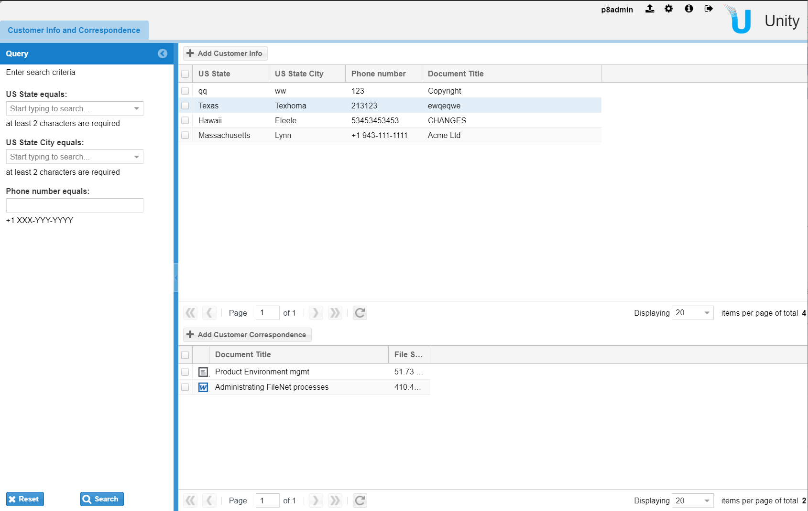

# Unity 7 Customization Tutorial

## Overview
This tutorial implements a very basic application that uses only simple document management capabilities of 
[Unity 7](https://www.intellective.com/unity) and
[IBM FileNet Content Manager](https://www.ibm.com/products/filenet-content-manager).

This sample is far enough from reflecting real business scenario. However, it covers many interesting 
configuration and customization topics that are required for creating any end-user application.

## The requirements
The requirements listed below follow the goal of implementing document management application supporting
corporate customer relationship activities.

The application should let users to do the following:

* Create and search objects representing `Customers` using fields such as `State`, `City` and `Telephone number`;
* For each `Customer` users should view and add `Correspondence` documents;
* Values for the `State` and `City` fields should be taken from the actual US dictionary;
* When searching using `Telephone number` application should validate the area code relying on the `State` and `City`
selected (use the actual area code dictionary as well).

From the UI point of view, it should implement master-detail approach. Users search and select `Customers` in master
(the top one) part. Selected `Customer` filters `Correpondence` documents at the detail (the bottom one) part.

## Implementation steps
This tutorial consists of several consecutive parts.
Follow one after another if you are recreating the application from the scratch.
Address [the GitHub repository](https://github.com/intellective-oss/u7-samples-crm-app) if you get stuck or want to compare your code with the final working result.

* [Step 1](./step1-creating-project.md): Creating, running, and debugging the Unity application
* [Step 2](./step2-solution-base.md): Configuring the data model and setting up the solution base
* [Step 3](./step3-implementing-master-detail): Implementing the master-detail search template tab
* [Step 4](./step4-creating-data-service): Creating the custom data service and the REST API
* [Step 5](./step5-selectors-and-validation): Implementing custom selectors and criteria field validation
* [Step 6](./step6-altering-search-result): Altering search results on the server-side
* [Step 7](./step7-custom-actions): Configuring actions for creating Customers and Correspondence documents
* [Step 8](./step8-staging-the-release): Staging the release using Docker image

## Community
### General feedback
Please send your feedback to [info@intellective.com](mailto:info@intellective.com).
### Contributing
Feel free to fix any issues by creating pull requests.