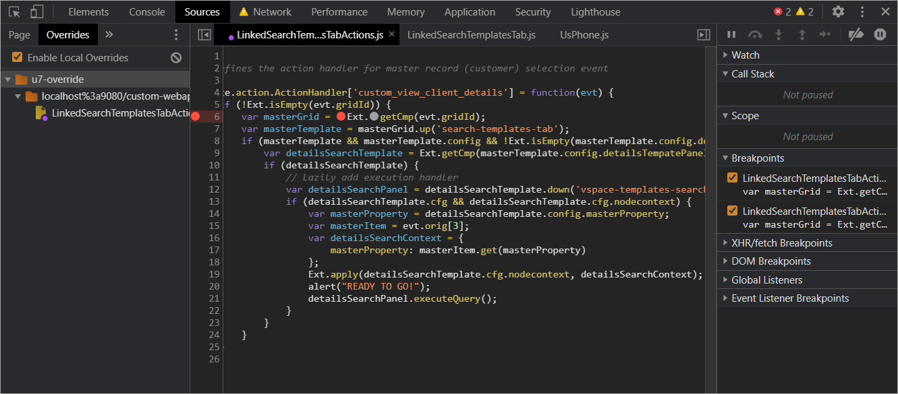

# Creating a project
Follow the guide of the archetype: https://github.com/intellective-oss/unity7-maven-archetype

Basically, you have to set up Maven access token and then run the following command (for Windows):
```
mvn archetype:generate "-DarchetypeGroupId=com.intellective.archetypes" ^
                       "-DarchetypeArtifactId=unity7-maven-archetype" ^
                       "-DarchetypeVersion=1.0.3" ^
                       "-DgroupId=com.intellective.sample" ^
                       "-DartifactId=u7-crm-app" ^
                       "-Dversion=1.0.0-SNAPSHOT" ^
                       "-DunityVersion=7.7.0-RC11"
```
Feel free to change versions of Unity or Unity archetype if necessary. 
It will start the project creation procedure. Confirm project creation by entering `Y` when asked.

# Building and running locally
To make the development build of the application, run the following command:
`mvn clean package -P web-dev-mode`.

We are going to use OpenLiberty application server to run and debug the application.
Download it from https://openliberty.io/downloads/. Choose the latest version with the "Web Profile 8"
package to avoid missing necessary features.

You’ll have to run/debug the application server quite often.
Create a script for the convenience. See the Windows batch script example:
```
@echo off
set JAVA_HOME=<JDK8_HOME>
set JVM_ARGS=-Xmx1g -DunityConfigUrl_custom_webapp="file:///<PROJECT_DIR>\custom-config\src\main\resources\unity\unity_config.xml"
<WLP_HOME>\wlp\bin\server.bat run
```
Replace the `<JDK_HOME>` placeholder by the path leading to OpenJDK 8 compliant distribution on your workstation;
`<PROJECT_DIR>` should lead to the source project location; and `<WLP_HOME>` stands here for the
OpenLiberty directory.  

Edit the `server.xml` file of the OpenLiberty instance. Insert, at least the following:
```xml
  <!-- ... -->
  <basicRegistry id="basic" realm="BasicRealm">
    <user name="intadmin" password="{xor}Lz4sLChvLTs=" />
    <user name="intuser1" password="{xor}Lz4sLChvLTs=" />
    <user name="intuser2" password="{xor}Lz4sLChvLTs=" />
  </basicRegistry>
  <jaasLoginContextEntry name="VES" id="VES" />
  <jaasLoginContextEntry name="vzv" id="vzv" />

  <application id="custom_app_war" location="<PROJECT_DIR>\custom-webapp\target\custom-webapp-1.0.0-SNAPSHOT.war" name="custom-webapp" type="war"/>
  <!-- ... -->
```
Please note that you'll have to update user's passwords in order to access the actual remote platform 
(IBM FileNet Content Manager) instance. The password above is `passw0rd`. 

To avoid keeping it "as-is" in your `server.xml` file you may use the `securityUtility` 
([see the documentation](https://www.ibm.com/support/knowledgecenter/SSEQTP_liberty/com.ibm.websphere.wlp.doc/ae/rwlp_command_securityutil.html))
to encrypt it.

Edit the environment variables file at `custom-config/src/main/resources/unity/unity_config-environment.ini`.
Make sure that you have actual values for the following parameters:
 - `cpe.url` should lead to the FileNet Composite Platform Engine.
 - `documents.object_store` defines the object store having the application data.
 - `devModeEnabled` sets if JS code should be minimized/obfuscated during the build (default value is `true`).

Run the application server using the script above. To test if the application is up and running, open http://localhost:9080/custom-webapp.

Note, that if you see the Configuration Wizard page (see the picture below) after you log in,
it means the application can't access the configuration file.

# Debugging
## Server-side
To debug the server-side, we should run OpenLiberty server in debug mode. Create a similar script for that:
```
@echo off
set JAVA_HOME=C:\Dev\Java\zulu-8
set JVM_ARGS=-Xmx1g -DunityConfigUrl_custom_webapp="file:///C:\Users\ozimakov\IdeaProjects\intellective-oss\samples\u7-crm-app\custom-config\src\main\resources\unity\unity_config.xml"
<WLP_HOME>\wlp\bin\server.bat debug
```
(basically, it calls for `server.bat debug` instead of `server.bat run`)

When the server starts it waits for the remote Java debugger to connect. Use the Java IDE of your choice. Create a debug configuration, by setting host name to `localhost` and port equal to `7777`.

## Client-side
To debug the client-side, use the developer tools of the browser. We recommend using Chrome and its developer tools.

Also, consider building the app using `web-dev-mode` profile. Otherwise, you will have to manage the minimized version of
JS code.


You can debug JS code, even change it on the fly using the `Overrides` function:



Here you change the code, test it immediately without rebuilding the app (which is definitely a time-consuming operation).
After you complete debugging, just copy the final version of the JS code into the main project sources. 
  
&rarr; [Next step: Configuring the data model and setting up the solution base](./step2-solution-base.md)
