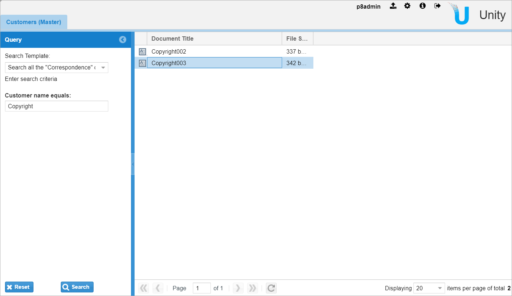

← [Previous step: Creating, running, and debugging the Unity application](./step1-creating-project.md)

# Preparing data
Here we are going to use [IBM FileNet Content Manager](https://www.ibm.com/products/filenet-content-manager)
to handle our data model and store documents representing `Customers` and `Correspondence`.

Solution data model consists of the following FileNet document classes:
1. Customer Info (`CustomerInfo`)
    * State (`State`, String (64), Single)
    * City (`City`, String(64), Single)
    * Phone Number (`PhoneNumber`, String(64), Single)
2. Correspondence (`Correspondence`)
    * Customer’s Name (`CustomerName`, String(64), Single)

Also, we should have a folder at `/Customers` to store these documents.

This is a very simple data model for a sake of this sample. You should not consider it as a guideline for implementing
real-life applications.

Before starting further development, it does make sense to create some documents in the folder mentioned above.
Just create a couple of documents using `CustomerInfo` class. Put company names into standard `DocumentTitle` field.
Then, create a number of documents of the `Correspondence` class. Link `Correspondence` to `Customer` by placing
its name into `CustomerName` field.

# Configuring the solution base
Now we start editing solution configuration at `custom-config/src/main/resources/unity/unity_config.xml`.

To keep the configuration files under version control, on this phase we strongly recommend editing XML file directly
instead of using Unity Configuration Console.

If you change the configuration (and not the code!) you have a way to reload it quickly by hitting the following
URL: http://localhost:9080/vu/reset.jsp. You have to be authorized in the application for that.

## Configuring connector
At first, add data source and data provider in the appropriate sections
(`/Configuration/Datasources` and `/Configuration/RepositoryDataProviders`):
```
    <Datasource ID="CustomerDS" class="com.vegaecm.vspace.datasources.CEDatasource">
        <URI>${ce.uri}</URI>
        <ObjectStore>${documents.object_store}</ObjectStore>
    </Datasource>
```
Note, that it relies on the environment variables externalized into the separate file at
`custom-config/src/main/resources/unity/unity_config-environment.ini`.

```
    <RepositoryDataProvider ID="Customer_repository"
                            class="com.vegaecm.vspace.providers.ce.CERepositoryDataProvider">
        <OperatorsSet>P8</OperatorsSet>
        <Operations>
            <Operation ID="add_content" type="add">
                <OperationProperties>
                    <Property ID="DocumentClass" type="FIRST">
                        <SecuredValue>
                            <Value>Document</Value>
                        </SecuredValue>
                    </Property>
                </OperationProperties>
                <DefineProperties>
                    <Property ID="DocumentTitle" type="FIRST">
                        <SecuredValue>
                            <Value>Title</Value>
                        </SecuredValue>
                    </Property>
                </DefineProperties>
            </Operation>
        </Operations>
        <DefineProperties/>
        <ViewerParameters/>
        <ResultLimit>2000</ResultLimit>
        <QuerySizeLimit>10000</QuerySizeLimit>
        <PagingMode>nonpaged</PagingMode>
        <DefineSecurityParentage>true</DefineSecurityParentage>
    
        <Datasource>CustomerDS</Datasource>
    
        <PropertyNameMapper>
            <Mapping external="document_id" internal="Id"/>
        </PropertyNameMapper>
    </RepositoryDataProvider>
```
In order to provide the data to the client, we have to define properties at `/Configuration/Properties`:
```
    <Property ID="DocumentTitle">
        <Name>Document Title</Name>
        <Type>string</Type>
        <Resizable>true</Resizable>
        <Sortable>true</Sortable>
        <MultiValue>false</MultiValue>
        <XType/>
        <Width>300</Width>
        <Tooltip/>
    </Property>
    <Property ID="Id">
        <Name>Id</Name>
        <Type>string</Type>
        <Resizable>true</Resizable>
        <Sortable>true</Sortable>
        <MultiValue>false</MultiValue>
        <XType/>
        <Width>115</Width>
        <Tooltip/>
    </Property>
    <Property ID="ContentSize">
        <Name>File Size</Name>
        <Type>int</Type>
        <Resizable>true</Resizable>
        <Sortable>true</Sortable>
        <MultiValue>false</MultiValue>
        <XType>vspace-filesize-column</XType>
        <Width>70</Width>
        <Tooltip/>
    </Property>
    <Property ID="MimeType">
        <Name>Mime Type</Name>
        <Type>string</Type>
        <Resizable>false</Resizable>
        <Sortable>true</Sortable>
        <MultiValue>false</MultiValue>
        <XType>vspace-mime-column</XType>
        <Width>28</Width>
        <Tooltip/>
        <Header/>
    </Property>
    <Property ID="State">
        <Name>US State</Name>
        <Type>string</Type>
        <Resizable>false</Resizable>
        <Sortable>true</Sortable>
        <MultiValue>false</MultiValue>
        <XType/>
        <Width>128</Width>
        <Tooltip/>
    </Property>
    <Property ID="City">
        <Name>US State City</Name>
        <Type>string</Type>
        <Resizable>false</Resizable>
        <Sortable>true</Sortable>
        <MultiValue>false</MultiValue>
        <XType/>
        <Width>128</Width>
        <Tooltip/>
    </Property>
    <Property ID="PhoneNumber">
        <Name>Phone number</Name>
        <Type>string</Type>
        <Resizable>false</Resizable>
        <Sortable>true</Sortable>
        <MultiValue>false</MultiValue>
        <XType/>
        <Width>128</Width>
        <Tooltip/>
    </Property>
    <Property ID="CustomerName">
        <Name>Customer name</Name>
        <Type>string</Type>
        <Resizable>false</Resizable>
        <Sortable>true</Sortable>
        <MultiValue>false</MultiValue>
        <XType/>
        <Width>128</Width>
        <Tooltip/>
    </Property>
```

## Master search template (Customers)

Now we can configure the search template for `Customer` documents (add it into `/Configuration/SearchTemplates` node):
```
    <SearchTemplate ID="Customer_Search">
        <DataProviderId>Customer_repository</DataProviderId>
        <Description>Search "Customer Info" using State, City, and Phone Number fields</Description>
        <Comment>Enter search criteria</Comment>
        <Autoexecute>true</Autoexecute>
        <Hidden>false</Hidden>
        <Operation dataProviderId="Customer_repository" type="search">
            <OperationProperties>
                <Property ID="query" type="FIRST">
                    <SecuredValue>
                        <Value>SELECT {Macro.ResultProperties} FROM CustomerInfo WHERE This INFOLDER '/Customers' AND {Macro.QueryCriterion}</Value>
                    </SecuredValue>
                </Property>
    
                <Property ID="objectStore" type="FIRST">
                    <SecuredValue>
                        <Value>${documents.object_store}</Value>
                    </SecuredValue>
                </Property>
            </OperationProperties>
        </Operation>
        <SortFields/>
        <Criteria>
            <Criterion>
                <FieldName>State</FieldName>
                <Comment>at least 2 characters are required</Comment>
                <Type>string</Type>
                <Operator>eq</Operator>
                <Required>false</Required>
                <Hidden>false</Hidden>
                <Readonly>false</Readonly>
                <MultiValue>false</MultiValue>
                <MinLength>2</MinLength>
                <MaxLength>128</MaxLength>
            </Criterion>
            <Criterion>
                <FieldName>City</FieldName>
                <Comment>at least 2 characters are required</Comment>
                <Type>string</Type>
                <Operator>eq</Operator>
                <Required>false</Required>
                <Hidden>false</Hidden>
                <Readonly>false</Readonly>
                <MultiValue>false</MultiValue>
                <MinLength>2</MinLength>
                <MaxLength>128</MaxLength>
            </Criterion>
            <Criterion>
                <FieldName>PhoneNumber</FieldName>
                <Comment>+1 XXX-YYY-YYYY</Comment>
                <Type>string</Type>
                <Operator>eq</Operator>
                <Required>false</Required>
                <Hidden>false</Hidden>
                <Readonly>false</Readonly>
                <MultiValue>false</MultiValue>
            </Criterion>
        </Criteria>
        <Grid ID="Customer_Grid"/>
    </SearchTemplate>
```

It defines the [FileNet Search SQL](https://www.ibm.com/support/knowledgecenter/en/SSNW2F_5.5.0/com.ibm.p8.ce.dev.ce.doc/query_sql_syntax_rel_queries.htm#query_sql_syntax_rel_queries__sql_statement_grammar) 
template and criteria for 3 fields: `State`, `City`, and `PhoneNumber`. 

Now we can define a grid for representing search result (add it into `/Configuaration/Grids` node):
```
    <Grid ID="Customer_Grid" enableColumnReorder="false" groupSearchResults="false">
        <Toolbar>
            <Actions/>
        </Toolbar>
        <Listeners>
            <Listener ID="ClickColumn"/>
        </Listeners>
        <XType>vspace-docs</XType>
        <Columns checkBoxModel="true" formatSet="default">
            <ColumnSet ID="Customer_Grid_ColSet_All" type="all"/>
            <ColumnSet ID="Customer_Grid_ColSet_Default" type="default"/>
        </Columns>
    </Grid>
```
It relies on 2 column sets - full list of columns and the default one showed to user. User can
change a set of visible columns by choosing from the full list. Add the following sections into
`/Configuration/ColumnSets` node of the configuration XML:
```
    <ColumnSet ID="Customer_Grid_ColSet_All">
        <Properties>
            <Property>State</Property>
            <Property>City</Property>
            <Property>PhoneNumber</Property>
            <Property>DocumentTitle</Property>
            <Property>ContentSize</Property>
        </Properties>
    </ColumnSet>
    <ColumnSet ID="Customer_Grid_ColSet_Default">
        <Properties>
            <Property>State</Property>
            <Property>City</Property>
            <Property>PhoneNumber</Property>
            <Property>DocumentTitle</Property>
        </Properties>
    </ColumnSet>
```

For now, we can use the out-of-the-box search template tab to display this search template
(`/Configuration/Tabs`):
```
    <Tab ID="CustomerDataTab-master">
        <Title>Customers (Master)</Title>
        <XType>search-templates-tab</XType>
        <Grid ID="Customer_Grid"/>
    </Tab>
```

To assign the search template to the tab, we need a search template set called `<TAB_ID>-templates-set`:
```
    <TemplateSet ID="CustomerDataTab-master-templates-set">
        <Template>Customer_Search</Template>
    </TemplateSet>
``` 

Now we can apply the configuration (restart the server or use `reset.jsp`) and take a look on what we have on this step:


## Details search template (Correspondence)
Aside of the idea that a result set for `Correspondence` documents should be filtered
using the selected `Customer` document name, we can define a search template for this in
the same fashion as we did above (at `/Configuration/SearchTemplates`):
```
    <SearchTemplate ID="Customer_Correspondence_Search">
        <DataProviderId>Customer_repository</DataProviderId>
        <Description>Search all the "Correspondence" documents for selected customer</Description>
        <Comment>Enter search criteria</Comment>
        <Autoexecute>false</Autoexecute>
        <Hidden>false</Hidden>
        <Operation dataProviderId="Customer_repository" type="search">
            <OperationProperties>
                <Property ID="query" type="FIRST">
                    <SecuredValue>
                        <Value>SELECT {Macro.ResultProperties} FROM Correspondence WHERE This INFOLDER '/Customers' AND {Macro.QueryCriterion}</Value>
                    </SecuredValue>
                </Property>
                <Property ID="objectStore" type="FIRST">
                    <SecuredValue>
                        <Value>${documents.object_store}</Value>
                    </SecuredValue>
                </Property>
            </OperationProperties>
        </Operation>
        <SortFields/>
        <Criteria>
            <Criterion>
                <FieldName>CustomerName</FieldName>
                <Type>string</Type>
                <Operator>eq</Operator>
                <Required>false</Required>
                <Hidden>true</Hidden> <!-- hidden -->
                <Readonly>false</Readonly>
                <MultiValue>false</MultiValue>
            </Criterion>
        </Criteria>
        <Grid ID="CustomerCorrespondence_Grid"/>
    </SearchTemplate>
```
Here we have the criteria that relies on `CustomerName` field. However, now it's just a plain string field.

A grid for the second search template (`/Configuration/Grids`):
```
    <Grid ID="CustomerCorrespondence_Grid" enableColumnReorder="false" groupSearchResults="false">
        <Toolbar>
            <Actions/>
        </Toolbar>
        <Listeners/>
        <XType>vspace-docs</XType>
        <Columns checkBoxModel="true" formatSet="default">
            <ColumnSet ID="CustomerCorrespondence_Grid_ColSet_All" type="all"/>
            <ColumnSet ID="CustomerCorrespondence_Grid_ColSet_Default" type="default"/>
        </Columns>
    </Grid>
```
Corresponding column sets (`/Configuration/ColumnSets`):
```
    <ColumnSet ID="CustomerCorrespondence_Grid_ColSet_All">
        <Properties>
            <Property>MimeType</Property>
            <Property>DocumentTitle</Property>
            <Property>ContentSize</Property>
        </Properties>
    </ColumnSet>
    <ColumnSet ID="CustomerCorrespondence_Grid_ColSet_Default">
        <Properties>
            <Property>MimeType</Property>
            <Property>DocumentTitle</Property>
            <Property>ContentSize</Property>
        </Properties>
    </ColumnSet>
```

Finally, add the search template into existing template set:
```
    <TemplateSet ID="CustomerDataTab-master-templates-set">
        <Template>Customer_Search</Template>
        <Template>Customer_Correspondence_Search</Template>
    </TemplateSet>
```
And now we can see the second search template availible in the application:


On this step, we have configured the application using only out-of-the-box capabilities.
We will use this solution base in our future customizations.

&rarr; [Next step: Implementing the master-detail search template tab](./step3-implementing-master-detail)