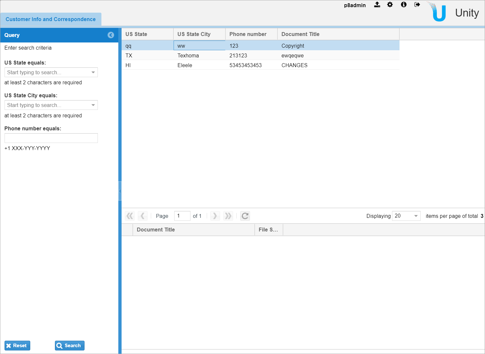
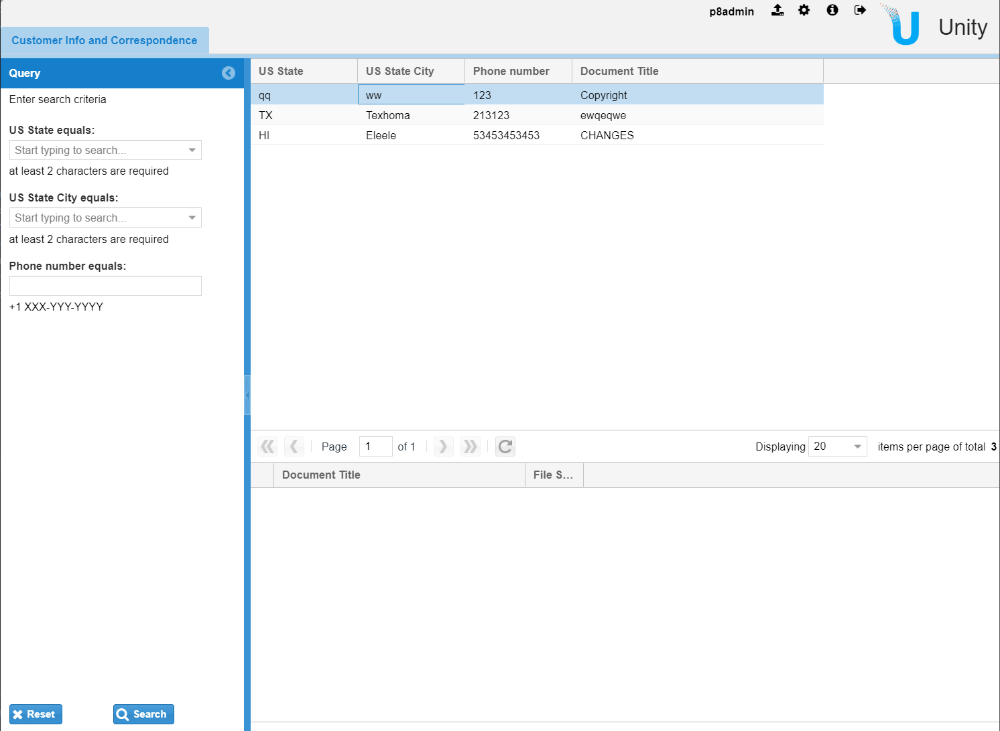

&larr; [Previous step: Configuring the data model and setting up the solution base](./step2-solution-base.md)

On this step we are going to implement master-detail behaviour. We will put search template components
one below another and wire up the details criteria for `Correspondence` with the selected `Customer` document.

# Implementing master-details tab 
At first, create a file [`custom-webapp/src/main/webapp/js/custom/tab/LinkedSearchTemplatesTab.js`](../custom-webapp/src/main/webapp/js/custom/tab/LinkedSearchTemplatesTab.js):
```javascript
/**
 * Override Unity component to display master and detail search templates, one is just below another.
 */
Ext.override(VSpace.templates.GridsPanel, {
    getTemplateGridConfig: function () {
        var templateGridConfig = this.callParent(arguments);
        if (this.ownerCt &&
            this.ownerCt.config &&
            this.ownerCt.config.cfg &&
            Ext.isObject(this.ownerCt.config.cfg.linkedTemplate)) {
            return {
                layout: 'border',
                region: 'center',
                items: [
                    {
                        layout: 'fit',
                        region: 'center',
                        flex: 3,
                        items: templateGridConfig
                    }, {
                        layout: 'fit',
                        region: 'south',
                        flex: 2,
                        items: this.ownerCt.config.cfg.linkedTemplate
                    }
                ]
            };
        }
        return templateGridConfig;
    }
});

/**
 Linked search templates - horizontal master-details component
 Top search template defines the customer. Bottom one searches documents related to the selected customer record.
 */
Ext.define('custom.tab.LinkedSearchTemplatesTab', {
    extend: 'Ext.Panel',
    alias: 'widget.custom-linked-search-templates-tab',

    constructor: function (config) {
        var pId = config.cfg.id + '-tab' + '-' + Ext.id();
        var detailsTempatePanelId = pId + '-details-search-templates';
        Ext.applyIf(config, {
            tabId: pId,
            solution: VSpace.utils.extractSolutionId(config.cfg.id),
            cfg: config.cfg,
            title: config.cfg.title,
            id: pId,
            layout: 'border',
            items: {
                layout: 'fit',
                region: 'center',
                flex: 3,
                items: {
                    id: pId + '-master-search-templates',
                    xtype: 'search-templates-tab',
                    detailsTempatePanelId: detailsTempatePanelId, // keep the reference to the 'details' template panel
                    cfg: {
                        id: config.cfg.id + '-master',
                        dataproviderid: config.cfg.dataproviderid,
                        grid: {
                            id: config.cfg.grid.id
                        },

                        // The below 'linked' search template will be displayed inside 'master' search template
                        linkedTemplate: {
                            id: detailsTempatePanelId,
                            xtype: 'search-templates-tab',
                            masterProperty: config.cfg.masterproperty, // master record property id to fetch details records
                            getQueryPanelConfig: function () {
                                return {
                                    hidden: true,    // hide query panel for the details search template
                                    templateDefaults: {
                                        active: false // disable auto-execution of the details template
                                    }
                                };
                            },
                            cfg: {
                                id: config.cfg.id + '-details',
                                dataproviderid: config.cfg.dataproviderid,
                                grid: {
                                    id: config.cfg.grid.id
                                },
                                nodecontext: {}
                            }
                        }
                    }
                }
            },
            urlSupported: true
        });

        this.callParent([config]);
    }
});
```
As you can see above, we define 2 components. The first one overrides the configuration of the out-of-the-box component
to place a 'linked' search template (details) below the master one. Second component implements the tab itself.
It gathers search templates and provide the `masterProperty` parameter for the 'linkedTemplate' that will pass the
selected `Customer's` name.

To include a new JS source file into the build, edit the [`wro-custom.xml`](../custom-webapp/src/main/wro-custom.xml) file:
```xml
<groups xmlns="http://www.isdc.ro/wro"
        xmlns:xsi="http://www.w3.org/2001/XMLSchema-instance"
        xsi:schemaLocation="http://www.isdc.ro/wro wro.xsd">

    <!-- Customization group -->
    <group name="customization">
        <js>/js/custom/tab/LinkedSearchTemplatesTab.js</js> <!-- ADD THIS ONE -->
        <css>/styling/overrides/sample-common.css</css>
    </group>
    <!-- END: Customization group -->

</groups>
```
Introduce a new tab in the [solution config](../custom-config/src/main/resources/unity/unity_config.xml).
In fact, you may replace the tab we've created on the previous step (ID=`CustomerDataTab-master`) with the following
one:
```xml
    <Tab ID="CustomerDataTab">
        <Title>Customer Info and Correspondence</Title>
        <XType>custom-linked-search-templates-tab</XType>
        <Grid ID="Customer_Grid"/>
        <CustomParameters>
            <DataProviderId>Customer_repository</DataProviderId>
            <MasterProperty>DocumentTitle</MasterProperty>
        </CustomParameters>
    </Tab>
```
Note, that it defines the `MasterProperty` parameter containing the name of the property (of the `Customer` document)
we are going to use as a key for searching `Correspondence`.

New component expects to have 2 different template sets. So, we need to rearrange it a bit (at `/Configuration/SearchTemplates`):
```xml
    <TemplateSet ID="CustomerDataTab-master-templates-set">
        <Template>Customer_Search</Template>
    </TemplateSet>
    <TemplateSet ID="CustomerDataTab-details-templates-set">
        <Template>Customer_Correspondence_Search</Template>
    </TemplateSet>
```
Rebuild the application using `mvn clean package -P web-dev-mode` command and see the result:


# Implementing action handler
Now, the only thing left on this step is implementing an action for selecting `Customer` document and filtering
`Correspondence` by this.
Add a new JS file at [`custom-webapp/src/main/webapp/js/custom/actions/LinkedSearchTemplatesTabActions.js`](../custom-webapp/src/main/webapp/js/custom/actions/LinkedSearchTemplatesTabActions.js):
```javascript
/**
 * Defines the action handler for master record (customer) selection event
 */
VSpace.action.ActionHandler['custom_view_client_details'] = function(evt) {
    if (!Ext.isEmpty(evt.gridId)) {
        var masterGrid = Ext.getCmp(evt.gridId);
        var masterTemplate = masterGrid.up('search-templates-tab');
        if (masterTemplate && masterTemplate.config && !Ext.isEmpty(masterTemplate.config.detailsTempatePanelId)) {
            var detailsSearchTemplate = Ext.getCmp(masterTemplate.config.detailsTempatePanelId);
            if (detailsSearchTemplate) {
                // Lazily add execution handler
                var detailsSearchPanel = detailsSearchTemplate.down('vspace-templates-search-panel');
                if (detailsSearchTemplate.cfg && detailsSearchTemplate.cfg.nodecontext) {
                    var masterProperty = detailsSearchTemplate.config.masterProperty;
                    var masterItem = evt.orig[3];
                    var detailsSearchContext = {
                        masterProperty: masterItem.get(masterProperty)
                    };
                    Ext.apply(detailsSearchTemplate.cfg.nodecontext, detailsSearchContext);
                    detailsSearchPanel.executeQuery();
                }
            }
        }
    }
};
```
Here we define the action handler to be called when a record is being selected in the master search template (grid).
We figure out what property needs to be passed, get it from the selected item at master grid and pass to the details.
Finally, we call `detailsSearchPanel.executeQuery()` to perform search with updated criteria.

As we already have done before, we should add a new JS source into the [`wro-custom.xml`](../custom-webapp/src/main/wro-custom.xml) file:
```xml
<groups xmlns="http://www.isdc.ro/wro"
        xmlns:xsi="http://www.w3.org/2001/XMLSchema-instance"
        xsi:schemaLocation="http://www.isdc.ro/wro wro.xsd">

    <!-- Customization group -->
    <group name="customization">
        <js>/js/custom/tab/LinkedSearchTemplatesTab.js</js>
        <js>/js/custom/actions/LinkedSearchTemplatesTabActions.js</js> <!-- ADD THIS ONE -->
        <css>/styling/overrides/sample-common.css</css>
    </group>
    <!-- END: Customization group -->

</groups>
```
In the configuration, add a listener for the master grid:
```xml
    <Grid ID="Customer_Grid" enableColumnReorder="false" groupSearchResults="false">
        <Toolbar>
            <Actions/>
        </Toolbar>
        <Listeners>
            <Listener ID="ClickColumn">
                <Action>custom_view_client_details</Action> <!-- ADD THIS ONE -->
            </Listener>
        </Listeners>
        <XType>vspace-docs</XType>
        <Columns checkBoxModel="true" formatSet="default">
            <ColumnSet ID="Customer_Grid_ColSet_All" type="all"/>
            <ColumnSet ID="Customer_Grid_ColSet_Default" type="default"/>
        </Columns>
    </Grid>
```

And finally, we have to enable the default value injection for the details search template:
```xml
    <SearchTemplate ID="Customer_Correspondence_Search">
        <DataProviderId>Customer_repository</DataProviderId>
        <Description>Search all the "Correspondence" documents for selected customer</Description>
        <Comment>Enter search criteria</Comment>
        <Autoexecute>false</Autoexecute>
        <Hidden>false</Hidden>
        <Operation dataProviderId="Customer_repository" type="search">
            <OperationProperties>
                <Property ID="query" type="FIRST">
                    <SecuredValue>
                        <Value>SELECT {Macro.ResultProperties} FROM Correspondence WHERE This INFOLDER '/Customers' AND {Macro.QueryCriterion}</Value>
                    </SecuredValue>
                </Property>
                <Property ID="objectStore" type="FIRST">
                    <SecuredValue>
                        <Value>${documents.object_store}</Value>
                    </SecuredValue>
                </Property>
            </OperationProperties>
        </Operation>
        <SortFields/>
        <Criteria>
            <Criterion>
                <FieldName>CustomerName</FieldName>
                <Type>string</Type>
                <Operator>eq</Operator>
                <Required>false</Required>
                <Hidden>false</Hidden> <!-- hidden -->
                <Readonly>false</Readonly>
                <MultiValue>false</MultiValue>
                <DefaultValue>{Level.masterProperty}</DefaultValue> <!-- ADD THIS ONE -->
            </Criterion>
        </Criteria>
        <Grid ID="CustomerCorrespondence_Grid"/>
    </SearchTemplate>
```
Here `{Level.masterProperty}` placeholder addresses the field from the context object we pass in the action handler below.

Rebuild the application to see the final result for this step: 



As you can see, we have a fully-functioning master-details search template tab.
At the same time we have `State`, `City`, and `PhoneNumber` fields. In order to let users fill them efficiently,
we should implement an appropriate server-side dictionary at first. 

&rarr; [Next step: Creating the custom data service and the REST API](./step4-creating-data-service.md)
