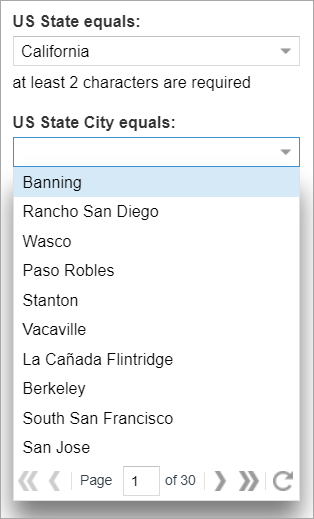
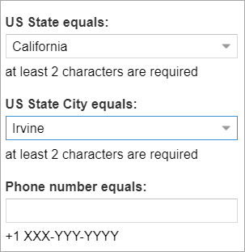

&larr; [Previous step: Creating the custom data service and the REST API](./step4-creating-data-service.md)

On this step we are going to use Spring data service and REST endpoint to implement field selectors (for `State` and 
`City`) and validation (`PhoneNumber`).

# Selectors
We are going to integrate our data service as Unity selectors and apply them for corresponding fields for Customer search template (master).

Implementing state selector:

[`com.intellective.sample.selector.UsStateSelector`](https://github.com/intellective-oss/u7-samples-crm-app/blob/master/custom-services/src/main/java/com/intellective/sample/selector/UsStateSelector.java)

```java
package com.intellective.sample.selector;

import com.intellective.sample.service.StatesCitiesDictionaryService;
import com.vegaecm.vspace.exception.VuRuntimeException;
import com.vegaecm.vspace.plugins.PluginDescriptor;
import com.vegaecm.vspace.plugins.PluginManager;
import com.vegaecm.vspace.selectors.AbstractCacheSelector;
import com.vegaecm.vspace.selectors.SelectorItem;
import com.vegaecm.vspace.utils.ApplicationContextHolder;
import org.springframework.context.ApplicationContext;
import org.springframework.web.context.support.WebApplicationContextUtils;

import java.util.List;
import java.util.Map;
import java.util.stream.Collectors;

public class UsStateSelector extends AbstractCacheSelector {

    private StatesCitiesDictionaryService getStatesCitiesDictionaryService() {
        ApplicationContext applicationContext =
                WebApplicationContextUtils.getWebApplicationContext(ApplicationContextHolder.getApplicationContext());
        return applicationContext.getBean(StatesCitiesDictionaryService.class);
    }

    @Override
    protected List<SelectorItem> readData(String s, Map<String, Object> map) throws VuRuntimeException {
        return getStatesCitiesDictionaryService().listStates().stream()
                .map(state -> new SelectorItem(state.getDisplayValue(), state.getStateCode()))
                .collect(Collectors.toList());
    }

    @Override
    public PluginDescriptor getDescriptor() {
        return new PluginDescriptor(
                "UsStateSelector",
                PluginManager.Type.SELECTOR_PLUGIN,
                "Static Selector",
                UsStateSelector.class.getName()
        );
    }

    @Override
    protected boolean timeoutExpire() {
        return false;
    }
}
```
Due to the inheritance of `AbstractCacheSelector` this selector loads the data using the service during the first call
and cache the items. As soon as `timeoutExpire()` returns `false`, this cache never expires which is 
absolutely appropriate (changing the number of states deserves server restart).

A simple test for this selector:

[`com.intellective.sample.selector.UsStateSelectorTest`](https://github.com/intellective-oss/u7-samples-crm-app/blob/master/custom-services/src/test/java/com/intellective/sample/selector/UsStateSelectorTest.java)

```java
package com.intellective.sample.selector;

import com.vegaecm.vspace.model.VarHandler;
import com.vegaecm.vspace.selectors.Selector;
import com.vegaecm.vspace.selectors.SelectorResult;
import org.junit.Assert;
import org.junit.FixMethodOrder;
import org.junit.Test;
import org.junit.runner.RunWith;
import org.junit.runners.MethodSorters;
import org.springframework.test.context.ContextConfiguration;
import org.springframework.test.context.junit4.SpringJUnit4ClassRunner;
import org.springframework.test.context.web.WebAppConfiguration;

import java.util.HashMap;

import static org.junit.Assert.assertEquals;
import static org.junit.Assert.assertTrue;

@RunWith(SpringJUnit4ClassRunner.class)
@WebAppConfiguration
@ContextConfiguration(locations = {
		"classpath:configuration/custom-services.xml"
})
public class UsStateSelectorTest extends BaseSelectorTest {

    @Test
    public void getData() {
    	Selector selector = configHolder.getSelectorHolder().getSelector("UsStateSelector");
        Assert.assertNotNull(selector);
        SelectorResult result =
                selector.getData(null, new VarHandler(), 0, Integer.MAX_VALUE, false, new HashMap<>());
        assertEquals(51, result.getTotalCount());
        assertTrue(result.getValues().stream().anyMatch(selectorItem -> selectorItem.getValue().equals("CA")));
    }
}
```

It uses the following base unit test (we are going to use it for city selector test as well):

[`com.intellective.sample.selector.BaseSelectorTest`](https://github.com/intellective-oss/u7-samples-crm-app/blob/master/custom-services/src/test/java/com/intellective/sample/selector/BaseSelectorTest.java)

```java
package com.intellective.sample.selector;

import com.vegaecm.vspace.TestUtils;
import com.vegaecm.vspace.config.ConfigHolder;
import com.vegaecm.vspace.config.manager.ConfigManager;
import com.vegaecm.vspace.config.manager.ConfigManagerFactory;
import com.vegaecm.vspace.i18n.I18nDataHolder;
import com.vegaecm.vspace.i18n.Locale;
import com.vegaecm.vspace.settings.UserSettings;
import com.vegaecm.vspace.utils.ApplicationContextHolder;
import org.junit.After;
import org.junit.Before;
import org.junit.Rule;
import org.junit.rules.TestName;
import org.slf4j.Logger;
import org.slf4j.LoggerFactory;
import org.springframework.beans.factory.annotation.Autowired;
import org.springframework.core.io.ClassPathResource;
import org.springframework.web.context.WebApplicationContext;

/**
 * Base class for selector tests
 */
public class BaseSelectorTest {

	protected final Logger logger = LoggerFactory.getLogger(getClass());
	protected ConfigHolder configHolder;

    @Autowired
    protected WebApplicationContext applicationContext;
    
    @Rule 
    public TestName testName = new TestName();

    @Before
    public void setUp() throws Exception {
		TestUtils.initAuthContext();
		ClassPathResource unityConfigurationResource = new ClassPathResource("unity_config.xml");
		ConfigManager configManager = ConfigManagerFactory.getConfigManager(unityConfigurationResource.getURI().toString());
		configHolder = new ConfigHolder(configManager, true);
		
        ApplicationContextHolder.setApplicationContext(applicationContext.getServletContext());
		
        I18nDataHolder.init("vspace");
        UserSettings userSettings = UserSettings.get();
        userSettings.setLocale(new Locale("en_US"));
        UserSettings.set(userSettings);
    }

    @After
    public void tearDown() {
        ApplicationContextHolder.setApplicationContext(null);
    }
}
```

To run these tests we have to have the Unity configuration. Place it into `custom-services/src/test/resources/unity_config.xml`
and declare the selector at `/Configuration/Selectors`:
```xml
    <Selector ID="UsStateSelector">
      <ClassName>com.intellective.sample.selector.UsStateSelector</ClassName>
      <Description/>
    </Selector>
```

Now, we are going to implement selector for the `City` field. It should support filtering by the selected `State`. 

[`com.intellective.sample.selector.UsCitySelector`](https://github.com/intellective-oss/u7-samples-crm-app/blob/master/custom-services/src/main/java/com/intellective/sample/selector/UsCitySelector.java)

```java
package com.intellective.sample.selector;

import com.google.common.base.Preconditions;
import com.intellective.sample.model.State;
import com.intellective.sample.service.StatesCitiesDictionaryService;
import com.vegaecm.vspace.exception.VuRuntimeException;
import com.vegaecm.vspace.model.Properties;
import com.vegaecm.vspace.model.VarHandler;
import com.vegaecm.vspace.plugins.PluginDescriptor;
import com.vegaecm.vspace.plugins.PluginManager;
import com.vegaecm.vspace.selectors.AbstractCacheSelector;
import com.vegaecm.vspace.selectors.SelectorItem;
import com.vegaecm.vspace.selectors.SelectorResult;
import com.vegaecm.vspace.utils.ApplicationContextHolder;
import org.springframework.context.ApplicationContext;
import org.springframework.web.context.support.WebApplicationContextUtils;

import java.util.Collections;
import java.util.HashMap;
import java.util.List;
import java.util.Map;
import java.util.stream.Collectors;

public class UsCitySelector extends AbstractCacheSelector {

    private StatesCitiesDictionaryService getStatesCitiesDictionaryService() {
        ApplicationContext applicationContext =
                WebApplicationContextUtils.getWebApplicationContext(ApplicationContextHolder.getApplicationContext());
        return applicationContext.getBean(StatesCitiesDictionaryService.class);
    }

    @Override
    public SelectorResult getData(String filter, VarHandler varHandler,
                                  Integer start, Integer limit,
                                  boolean isFilterEntry, Map<String, Object> properties) throws VuRuntimeException {
        // expose This.${StateCodeProperty} context scope value at properties
        Map<String, Object> localProperties = null != properties ? properties : new HashMap<>();
        String stateCodePropertyName = (String) this.properties.get("StateCodeProperty");
        Preconditions.checkState(stateCodePropertyName != null, "'StateCodeProperty' selector property is not set");
        localProperties.put("StateCodeValue", varHandler.replace("{This." + stateCodePropertyName + "}"));
        return super.getData(filter, varHandler, start, limit, isFilterEntry, localProperties);
    }

    @Override
    protected List<SelectorItem> readData(String resolvedQuery, Map<String, Object> properties) throws VuRuntimeException {
        String stateCodePropertyValue = (String) properties.get("StateCodeValue");
        State state = getStatesCitiesDictionaryService().getStateByCode(stateCodePropertyValue);
        return state != null ? state.cities().values().stream()
                .map(city -> new SelectorItem(city.getName(), city.getName()))
                .collect(Collectors.toList()) : Collections.emptyList();
    }

    @Override
    public PluginDescriptor getDescriptor() {
        return new PluginDescriptor(
                "UsCitySelector",
                PluginManager.Type.SELECTOR_PLUGIN,
                "Static Selector",
                UsCitySelector.class.getName()
        );
    }

    @Override
    protected boolean timeoutExpire() {
        return true;
    }

}
```

It reads a state code value from the input properties and uses the appropriate method of the service to get the state
object with a list of cities within. Unlike the state selector above, we should disable cache here as soon as it doesn't
respect the input parameter (state code). That's why `timeoutExpire()` returns `true` all the time.

We have to create a test for this selector as well:

[`com.intellective.sample.selector.UsCitySelectorTest`](https://github.com/intellective-oss/u7-samples-crm-app/blob/master/custom-services/src/test/java/com/intellective/sample/selector/UsCitySelectorTest.java)

```java
package com.intellective.sample.selector;

import com.vegaecm.vspace.model.MapVarScopeImpl;
import com.vegaecm.vspace.model.VarHandler;
import com.vegaecm.vspace.model.VarScope;
import com.vegaecm.vspace.selectors.Selector;
import com.vegaecm.vspace.selectors.SelectorResult;
import org.junit.Assert;
import org.junit.FixMethodOrder;
import org.junit.Test;
import org.junit.runner.RunWith;
import org.junit.runners.MethodSorters;
import org.springframework.test.context.ContextConfiguration;
import org.springframework.test.context.junit4.SpringJUnit4ClassRunner;
import org.springframework.test.context.web.WebAppConfiguration;

import java.util.Collections;

@RunWith(SpringJUnit4ClassRunner.class)
@WebAppConfiguration
@ContextConfiguration(locations = {
		"classpath:configuration/custom-services.xml"
})
public class UsCitySelectorTest extends BaseSelectorTest {

    @Test
    public void getData() throws Exception {
    	Selector selector = configHolder.getSelectorHolder().getSelector("UsCitySelector");
        Assert.assertNotNull(selector);

        // no state selected
        VarHandler varHandler = new VarHandler();
        SelectorResult result =
        		selector.getData(null, varHandler, 0, Integer.MAX_VALUE, false, null);
        Assert.assertEquals(0, result.getTotalCount());

        // state = CA
        varHandler = new VarHandler();
        varHandler.getHolder().registerScope(VarScope.THIS, new MapVarScopeImpl(Collections.singletonMap("StateCode", "CA")));
        result = selector.getData(null, varHandler, 0, Integer.MAX_VALUE, false, null);
        Assert.assertEquals(297, result.getTotalCount());

        // state = NY
        varHandler = new VarHandler();
        varHandler.getHolder().registerScope(VarScope.THIS, new MapVarScopeImpl(Collections.singletonMap("StateCode", "NY")));
        result = selector.getData(null, varHandler, 0, Integer.MAX_VALUE, false, null);
        Assert.assertEquals(84, result.getTotalCount());

        // non-existent state
        varHandler = new VarHandler();
        varHandler.getHolder().registerScope(VarScope.THIS, new MapVarScopeImpl(Collections.singletonMap("StateCode", "ZZ")));
        result = selector.getData(null, varHandler, 0, Integer.MAX_VALUE, false, null);
        Assert.assertEquals(0, result.getTotalCount());
    }
}
``` 
And the corresponding piece of configuration (`custom-services/src/test/resources/unity_config.xml`) for testing:
```xml
    <Selector ID="UsCitySelector">
      <ClassName>com.intellective.sample.selector.UsCitySelector</ClassName>
      <Description/>
      <Property ID="StateCodeProperty" value="StateCode"/>
    </Selector>
```
Run the tests to ensure everything works fine. After that, move those pieces of configuration into the main configuartion
[`custom-config/src/main/resources/unity/unity_config.xml`](https://github.com/intellective-oss/u7-samples-crm-app/blob/master/custom-config/src/main/resources/unity/unity_config.xml).

Here we are ready to apply selectors to fields:
```xml
    <Criterion>
        <FieldName>State</FieldName>
        <Comment>at least 2 characters are required</Comment>
        <Type>string</Type>
        <Operator>eq</Operator>
        <Required>false</Required>
        <Hidden>false</Hidden>
        <Readonly>false</Readonly>
        <MultiValue>false</MultiValue>
        <MinLength>2</MinLength>
        <MaxLength>64</MaxLength>
        <SelectorId>UsStateSelector</SelectorId> <!-- ADD THIS -->
    </Criterion>  
    <Criterion>
        <FieldName>City</FieldName>
        <Comment>at least 2 characters are required</Comment>
        <Type>string</Type>
        <Operator>eq</Operator>
        <Required>false</Required>
        <Hidden>false</Hidden>
        <Readonly>false</Readonly>
        <MultiValue>false</MultiValue>
        <MinLength>2</MinLength>
        <MaxLength>64</MaxLength>
        <Linked>State</Linked>                  <!-- AND THIS -->
        <SelectorId>UsCitySelector</SelectorId>  <!-- AND THIS -->
    </Criterion>
```
We assign selectors, so our fields will get lookups automatically. 
Also, we declare the second one as dependent in a way that selected `State` goes as an input for selector values for `City`.

Rebuild the application and see how it works.



# Criteria validation
We have the “Phone number” field. So, we can validate the entered value using the area code for the selected state/city 
using the REST API we have already implemented.



Implementing the client-side validator.

[`custom-webapp/src/main/webapp/js/custom/validation/UsPhone.js`](custom-webapp/src/main/webapp/js/custom/validation/UsPhone.js)

```javascript
Ext.define('Override.form.field.VTypes', {
    override: 'Ext.form.field.VTypes',

    UsPhone: function (value, field) {
        if (this.UsPhoneRe.test(value)) {
            Ext.defer(this.validateUsPhoneAreaCode, 10, this, [value, field]); // async validation
            return true;
        }
        return false;
    },

    validateUsPhoneAreaCode: function (phoneNumber, field) {
        var me = this;
        var stateCode =
            field.up('search-template-criteria-form').getFieldNamesAndValues().State;
        var cityName =
            field.up('search-template-criteria-form').getFieldNamesAndValues().City;
        var areaCode =
            0 === phoneNumber.indexOf('+') ? phoneNumber.substr(3, 3)
                : phoneNumber.substr(0, 3);

        if (stateCode && cityName) {
            Ext.Ajax.request({
                url: 'custom-api/1.0/states/' + encodeURIComponent(stateCode) + '/' + encodeURIComponent(cityName) + '/validate',
                method: 'POST',
                params: {
                    areaCode: areaCode
                },

                success: function (response) {
                    var result = Ext.decode(response.responseText, true);
                    if (null != result) {
                        if (result.success) {
                            if (result.payload.valid) {
                                field.clearInvalid();
                            } else {
                                field.markInvalid(me.UsPhoneAreaCodeInvalidText);
                            }
                        }
                    } else {
                        Ext.Msg.alert('Warning', 'Invalid server response when validating US phone area code. Response: ' + response.responseText);
                    }
                },

                failure: function (response) {
                    Ext.Msg.alert('Failure', 'Server-side failure with status code ' + response.status);
                }
            });
        }
    },

    UsPhoneRe: /^(\+1\s?)?((\([0-9]{3}\))|[0-9]{3})[\s\-]?[\0-9]{3}[\s\-]?[0-9]{4}$/,
    UsPhoneText: 'Expected format is +1 XXX-YYY-YYYY where XXX is the valid US area code',
    UsPhoneAreaCodeInvalidText: 'The area code should match the selected state',
    UsPhoneMask: /[0-9\+\-\s]/i
});
``` 
Here we combine a client-side validation (regexp) with server-side call. 
When the entered value satisfies the regexp, we extract the area code from the string, also get selected `State` and `City`, and
call the API (do POST at `/custom-api/1.0/states/{stateCode}/{cityName}/validate`). Marking the field validation
in order what's the result.

We shouldn't forget to add a new source into `wro-custom.xml`:
```xml
<groups xmlns="http://www.isdc.ro/wro"
        xmlns:xsi="http://www.w3.org/2001/XMLSchema-instance"
        xsi:schemaLocation="http://www.isdc.ro/wro wro.xsd">

    <!-- Customization group -->
    <group name="customization">
        <js>/js/custom/tab/LinkedSearchTemplatesTab.js</js>
        <js>/js/custom/actions/LinkedSearchTemplatesTabActions.js</js>
        <js>/js/custom/validation/UsPhone.js</js>   <!-- ADD THIS ONE -->
        <css>/styling/overrides/sample-common.css</css>
    </group>
    <!-- END: Customization group -->

</groups>
```

Edit the configuration to enable validation for the criteria:
```xml
    <Criterion>
        <FieldName>PhoneNumber</FieldName>
        <Comment>+1 XXX-YYY-YYYY</Comment>
        <Type>string</Type>
        <Operator>eq</Operator>
        <Required>false</Required>
        <Hidden>false</Hidden>
        <Readonly>false</Readonly>
        <MultiValue>false</MultiValue>
        <VType>UsPhone</VType> <!-- ADD THIS ONE -->
    </Criterion>
```
Test and see how it works. Use browser developer tool to see the network interaction (calling for the validation API).

Application is getting more and more convenient for users. However, we are still getting the state codes in the
search result set. Although for our case it's not so critical (state codes are well-known by the most of the users),
it is a very common requirement to transform keys to display values.

&rarr; [Next step: Altering search results on the server-side](./step6-altering-search-result.md)