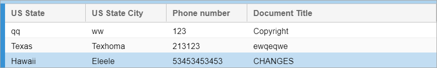

← [Previous step: Implementing custom selectors and criteria field validation](./step5-selectors-and-validation.md)

Our task for this step is to alter the response of existing search template endpoint by changing
state codes on corresponding display values. The use-case for this approach is extremely high. However, we
should always consider a performance rate of this procedure.

# Altering grid data
At first, we should create a wrapper that accumulates server response body and allows to return it as a String. 
It is necessary to parse JSON response.

[`com.intellective.sample.web.ByteResponseWrapper`](https://github.com/intellectivelab/u7-samples-crm-app/blob/master/custom-services/src/main/java/com/intellective/sample/web/ByteResponseWrapper.java)

```java
package com.intellective.sample.web;

import javax.servlet.ServletOutputStream;
import javax.servlet.WriteListener;
import javax.servlet.http.HttpServletResponse;
import javax.servlet.http.HttpServletResponseWrapper;
import java.io.ByteArrayOutputStream;
import java.io.IOException;
import java.io.OutputStreamWriter;
import java.io.PrintWriter;

/**
 * Wrapper for response. Allows to accumulate and return data as String
 */
public class ByteResponseWrapper extends HttpServletResponseWrapper {
    private ByteArrayServletOutputStream wrapOutputStream = null;
    private PrintWriter printWriter = null;

    public ByteResponseWrapper(HttpServletResponse response) {
        super(response);
    }

    public void close() throws IOException {
        if (this.printWriter != null) {
            this.printWriter.close();
        }

        if (this.wrapOutputStream != null) {
            this.wrapOutputStream.close();
        }
    }

    /**
     * Flush OutputStream or PrintWriter
     *
     * @throws IOException
     */
    @Override
    public void flushBuffer() throws IOException {
        if (this.printWriter != null) {
            this.printWriter.flush();
        }

        IOException exception1 = null;
        try {
            if (this.wrapOutputStream != null) {
                this.wrapOutputStream.flush();
            }
        } catch (IOException e) {
            exception1 = e;
        }

        IOException exception2 = null;
        try {
            super.flushBuffer();
        } catch (IOException e) {
            exception2 = e;
        }

        if (exception1 != null) throw exception1;
        if (exception2 != null) throw exception2;
    }

    @Override
    public ServletOutputStream getOutputStream() throws IOException {
        if (printWriter != null) {
            throw new IllegalStateException(
                    "PrintWriter obtained already - cannot get OutputStream");
        }
        if (wrapOutputStream == null) {
            wrapOutputStream = new ByteArrayServletOutputStream();
        }
        return wrapOutputStream;
    }

    @Override
    public PrintWriter getWriter() throws IOException {
        if (printWriter == null && wrapOutputStream != null) {
            throw new IllegalStateException(
                    "OutputStream obtained already - cannot get PrintWriter");
        }
        if (this.printWriter == null) {
            wrapOutputStream = new ByteArrayServletOutputStream();
            printWriter =
                    new PrintWriter(new OutputStreamWriter(wrapOutputStream,
                            getResponse().getCharacterEncoding()));
        }
        return this.printWriter;
    }

    /**
     * Returns the response data as String
     *
     * @return String with the response
     * @throws IOException
     */
    public String getData() throws IOException {
        return null != wrapOutputStream ? wrapOutputStream.toString(getResponse().getCharacterEncoding()) : null;
    }

    class ByteArrayServletOutputStream extends ServletOutputStream {

        private ByteArrayOutputStream wrapOutputStream;

        public ByteArrayServletOutputStream() throws IOException {
            super();
            this.wrapOutputStream = new ByteArrayOutputStream();
        }

        @Override
        public void close() throws IOException {
            this.wrapOutputStream.close();
        }

        @Override
        public void flush() throws IOException {
            this.wrapOutputStream.flush();
        }

        @Override
        public void write(byte b[]) throws IOException {
            this.wrapOutputStream.write(b);
        }

        @Override
        public void write(byte b[], int off, int len) throws IOException {
            this.wrapOutputStream.write(b, off, len);
        }

        @Override
        public void write(int b) throws IOException {
            this.wrapOutputStream.write(b);
        }

        @Override
        public boolean isReady() {
            return true;
        }

        @Override
        public void setWriteListener(WriteListener writeListener) {
            // NO-OP
        }

        public String toString(String charsetName) throws IOException {
            return wrapOutputStream.toString(charsetName);
        }
    }

}
```

Now, we can create a filter:

[`com.intellective.sample.web.StateCodeResolverFilter`](https://github.com/intellectivelab/u7-samples-crm-app/blob/master/custom-services/src/main/java/com/intellective/sample/web/StateCodeResolverFilter.java)

```java
package com.intellective.sample.web;

import com.intellective.sample.model.State;
import com.intellective.sample.service.StatesCitiesDictionaryService;
import com.vegaecm.vspace.utils.ApplicationContextHolder;
import org.apache.commons.lang3.StringUtils;
import org.json.JSONArray;
import org.json.JSONObject;
import org.slf4j.Logger;
import org.slf4j.LoggerFactory;
import org.springframework.context.ApplicationContext;
import org.springframework.web.context.support.WebApplicationContextUtils;

import javax.servlet.*;
import javax.servlet.http.HttpServletResponse;
import java.io.IOException;

/**
 * Servlet filter replacing State field value (a code) by display value
 */
public class StateCodeResolverFilter implements Filter {

    private static Logger logger = LoggerFactory.getLogger(StateCodeResolverFilter.class);

    public static final String DEFAULT_STATE_PROPERTY_NAME = "State";
    public static final String DEFAULT_CITY_PROPERTY_NAME = "City";

    protected String stateCodePropertyName;
    protected String cityCodePropertyName;

    protected StatesCitiesDictionaryService statesCitiesDictionaryService;

    @Override
    public void init(FilterConfig filterConfig) {
        stateCodePropertyName = filterConfig.getInitParameter("stateCodePropertyName");
        if (null == stateCodePropertyName) {
            stateCodePropertyName = DEFAULT_STATE_PROPERTY_NAME;
        }
        cityCodePropertyName = filterConfig.getInitParameter("cityCodePropertyName");
        if (null == cityCodePropertyName) {
            cityCodePropertyName = DEFAULT_CITY_PROPERTY_NAME;
        }
        logger.info("Using state property: {} and city property: {}", stateCodePropertyName, cityCodePropertyName);

        ApplicationContext applicationContext =
                WebApplicationContextUtils.getWebApplicationContext(ApplicationContextHolder.getApplicationContext());
        statesCitiesDictionaryService = applicationContext.getBean(StatesCitiesDictionaryService.class);
    }

    @Override
    public void destroy() {
        // NO-OP
    }

    @Override
    public void doFilter(ServletRequest request,
                         ServletResponse response,
                         FilterChain chain) throws IOException, ServletException {
        // wrap the response and pass it further to catch the response afterwards
        ByteResponseWrapper responseWrapper = new ByteResponseWrapper((HttpServletResponse) response);
        chain.doFilter(request, responseWrapper);

        // get RAW JSON string
        String rawJsonString = responseWrapper.getData();
        logger.trace("Got RAW JSON: {}", rawJsonString);

        if (null != rawJsonString) {
            // Catch search operation response and replace the codes on display values.
            // Thus, on the search result grid, we should see display values.
            JSONObject jsonResult = new JSONObject(rawJsonString);
            JSONArray docs = jsonResult.optJSONArray("docs");
            if (null != docs) {
                for (int i = 0; i < docs.length(); i++) {
                    JSONObject documentProperties =
                            docs.getJSONObject(i).getJSONObject("properties");

                    // Replacing a State code to State display name
                    String stateCode = documentProperties.optString(stateCodePropertyName);
                    if (StringUtils.isNotEmpty(stateCode)) {
                        State state = statesCitiesDictionaryService.getStateByCode(stateCode);
                        if (state != null) {
                            documentProperties.put(stateCodePropertyName, state.getDisplayValue());
                        }
                    }
                }
            }
            jsonResult.write(response.getWriter());
        }
    }
}
```

Note that we are making this code safe. If it did not find a State by its code it wouldn’t change the value. So, it will work disregarding the data correctness.

Now, we should add it into `web.xml` of the resulting app. For that, we have the `custom_addon_web.xml` file:

[`custom-webapp/src/main/custom_addon_web.xml`](https://github.com/intellectivelab/u7-samples-crm-app/blob/master/custom-webapp/src/main/custom_addon_web.xml)

```xml
<web-app>

    <filter-mapping>
        <filter-name>AuthFilter</filter-name>
        <url-pattern>/custom-api/*</url-pattern>
    </filter-mapping>

    <servlet>
        <servlet-name>custom-api-dispatcher</servlet-name>
        <servlet-class>org.springframework.web.servlet.DispatcherServlet</servlet-class>
        <init-param>
            <param-name>contextConfigLocation</param-name>
            <param-value>/WEB-INF/configuration/custom-api-servlet.xml</param-value>
        </init-param>
        <init-param>
            <param-name>throwExceptionIfNoHandlerFound</param-name>
            <param-value>true</param-value>
        </init-param>
    </servlet>
    <servlet-mapping>
        <servlet-name>custom-api-dispatcher</servlet-name>
        <url-pattern>/custom-api/*</url-pattern>
    </servlet-mapping>

    <!-- ADD THIS PART -->
    <filter>
        <filter-name>StateCodeResolverFilter</filter-name>
        <filter-class>com.intellective.sample.web.StateCodeResolverFilter</filter-class>
        <init-param>
            <param-name>stateCodePropertyName</param-name>
            <param-value>State</param-value>
        </init-param>
        <init-param>
            <param-name>cityCodePropertyName</param-name>
            <param-value>City</param-value>
        </init-param>
    </filter>
    <filter-mapping>
        <filter-name>StateCodeResolverFilter</filter-name>
        <url-pattern>/services/search/templates</url-pattern>
    </filter-mapping>
    <!-- END OF THE PART -->

</web-app>
```

Note that we apply the filter onto search template endpoint only.

Rebuild the application and see how it works.



Now, the only things left from the development side are actions for creating `Customers` and `Correspondence` documents. 

&rarr; [Next step: Implementing actions for creating Customers and Correspondence documents](./step7-custom-actions.md)