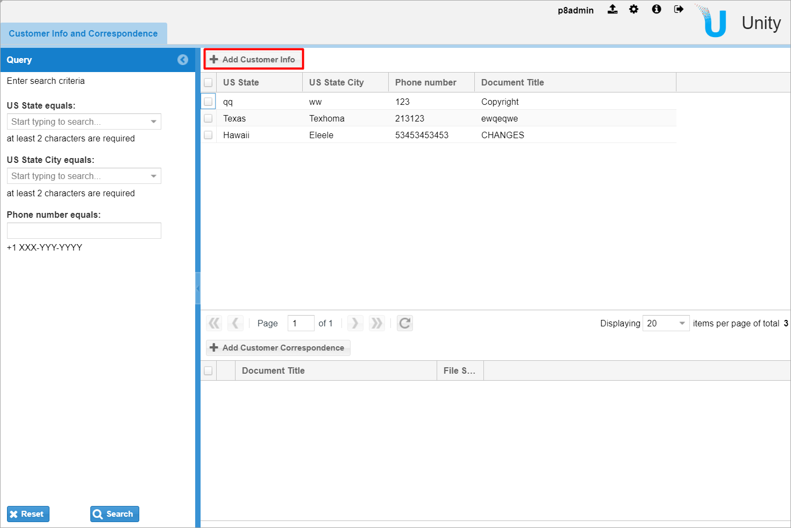
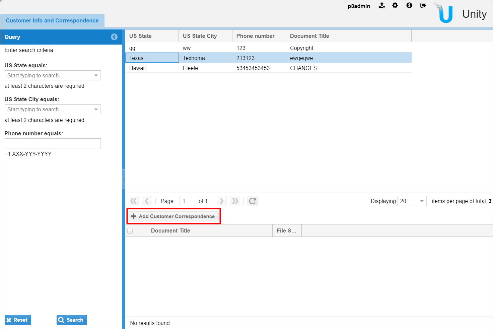
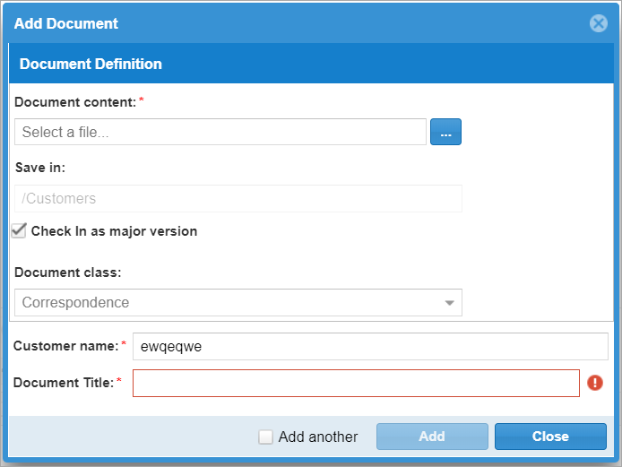

&larr; [Previous step: Altering search results on the server-side](./step6-altering-search-result.md)

Finally, we need to allow our users to create new `Customers` and `Correspondence` documents for them easily. 
The first one will be created using configuration only. However, the second one will require some custom logic 
for passing selected Customer object. So, we will have to create a customized “Add document” action for that.

# Creating Customers
At first, we are going to configure the action for adding new Customers. 
Note, that we use document class to store those objects so users have to attach some document
when they create it. From the business perspective, it might be a contract, a customer information card or anything
else.

Add the action to the solution configuration (at `/Configuration/Actions` node):
```xml
    <Action ID="add_CustomerInfo" multiselect="true" scope="single" type="toolbar">
            <Name>Add Customer Info</Name>
            <IconCls>action-add-document</IconCls>
            <Tooltip>Add Customer Info</Tooltip>
            <Uri/>
            <Parameters>
                <DocumentClass>
                    <RepositoryDataProvider ID="Customer_repository">
                        <Disabled>false</Disabled>
                        <DefaultValue>{value: "CustomerInfo", name: "CustomerInfo"}</DefaultValue>
                        <SelectorId>CustomerInfoClass</SelectorId>
                        <Roles/>
                    </RepositoryDataProvider>
              </DocumentClass>
            </Parameters>
            <CustomParameters>
                <ActionHandlerId>add_document</ActionHandlerId>
                <RepositoryDataProvider ID="Customer_repository">
                    <FolderPicker>
                        <Visible>false</Visible>
                        <TreeModel name="CEFoldersWithRoot">
                            <Properties>
                                <Property ID="FolderPath" value="/Customers"/>
                                <Property ID="DataProviderId" value="Customer_repository"/>
                                <Property ID="LazyLoading" value="true"/>
                            </Properties>
                        </TreeModel>
                    </FolderPicker>
                    <UpdateTemplateId>properties_template_add_customer_info</UpdateTemplateId>
                    <Fields>
                        <DocumentTitle>DocumentTitle</DocumentTitle>
                    </Fields>
                </RepositoryDataProvider>
            </CustomParameters>
    </Action>
```
Here we predefine a folder (“/Customers”) to file these documents in. Also, we need to create a single-valued selector 
for the document class (add it into the `/Configuration/Selectors` node):
```xml
    <Selector ID="CustomerInfoClass">
      <ClassName>com.vegaecm.vspace.selectors.XMLSelector</ClassName>
      <Description/>
      <Option name="CustomerInfo" value="CustomerInfo"/>
      <Property ID="RefreshTimeoutSec" value="86400"/>
    </Selector>
```

We define the update template with a set of fields we want users to fill when they create a record
(add it into the `/Configuration/UpdateTemplates` node):
```xml
    <UpdateTemplate ID="properties_template_add_customer_info">
       <UpdateItems>
          <UpdateItem>
             <FieldName>DocumentTitle</FieldName>
             <Type>string</Type>
             <ReadOnly>false</ReadOnly>
             <Required>true</Required>
          </UpdateItem>
          <UpdateItem>
             <FieldName>State</FieldName>
             <Type>string</Type>
             <ReadOnly>false</ReadOnly>
             <Required>true</Required>
            <SelectorId>UsStateSelector</SelectorId>
          </UpdateItem>
          <UpdateItem>
             <FieldName>City</FieldName>
             <Type>string</Type>
             <ReadOnly>false</ReadOnly>
             <Required>true</Required>
            <Linked>State</Linked>
            <SelectorId>UsCitySelector</SelectorId>
          </UpdateItem>
          <UpdateItem>
             <FieldName>PhoneNumber</FieldName>
             <Type>string</Type>
             <ReadOnly>false</ReadOnly>
             <Required>true</Required>
          </UpdateItem>
       </UpdateItems>
    </UpdateTemplate>
```
See that we are reusing custom selectors here as well. So, users will be selecting `State` and `City` 
exactly as they do it in search criteria. 

The only step left here is to add the action on the master grid toolbar:
```xml
<Grid ID="Customer_Grid" enableColumnReorder="false" groupSearchResults="false">
    <Toolbar>
        <Actions>
            <Action ID="add_CustomerInfo"/>  <!-- ADD THIS ONE -->
        </Actions>
    </Toolbar>
    <Listeners>
        <Listener ID="ClickColumn">
            <Action>custom_view_client_details</Action>
        </Listener>
    </Listeners>
    <XType>vspace-docs</XType>
    <Columns checkBoxModel="true" formatSet="default">
        <ColumnSet ID="Customer_Grid_ColSet_All" type="all"/>
        <ColumnSet ID="Customer_Grid_ColSet_Default" type="default"/>
    </Columns>
</Grid>
```

Reset and test the configuration.



# Creating Correspondence
Next, we are going to extend the dialog component used for adding documents to make a process of creating 
`Correspondence` documents much easier for users. It catches the selected record, get the `CustomerName` field value
and pull it on the form. 

[`custom-webapp/src/main/webapp/js/custom/actions/AddCustomerCorrespondenceDialog.js`](https://github.com/intellective-oss/u7-samples-crm-app/blob/master/custom-webapp/src/main/webapp/js/custom/actions/AddCustomerCorrespondenceDialog.js)

```javascript
Ext.define('custom.action.AddCustomerCorrespondenceDialog', {
    extend : 'VSpace.action.dialog.AddDialog',
    alias: 'widget.custom-action-AddCustomerCorrespondence-dialog',

    titleAutoFill: function () {
        this.callParent(arguments);

        var me = this;
        var customerName = this.nodeContext.CustomerName;
        var elements = Ext.select('#' + me.panelId + ' .criterion', true).elements;
        Ext.each(elements, function (element) {
            var input = element.component;
            if ('CustomerName' === element.component.name) {
                input.setValue(customerName);
                input.fireEvent('valueChanged', input, customerName, '');
            }
        });
    }
});
```

The action handler itself:

[`custom-webapp/src/main/webapp/js/custom/actions/AddCustomerCorrespondence.js`](https://github.com/intellective-oss/u7-samples-crm-app/blob/master/custom-webapp/src/main/webapp/js/custom/actions/AddCustomerCorrespondence.js)

```javascript
VSpace.action.ActionHandler['add_CustomerCorrespondence'] = function(evt) {
   var linkedTemplatesTab = Ext.getCmp(evt.gridId).up('custom-linked-search-templates-tab');
   var masterTemplate = Ext.getCmp(linkedTemplatesTab.getId() + '-master-search-templates');
   if (masterTemplate && masterTemplate.config && !Ext.isEmpty(masterTemplate.config.detailsTempatePanelId)) {
		var detailsSearchTemplate = Ext.getCmp(masterTemplate.config.detailsTempatePanelId);
		if (detailsSearchTemplate && detailsSearchTemplate.cfg && detailsSearchTemplate.cfg.nodecontext) {
            if (Ext.isEmpty(detailsSearchTemplate.cfg.nodecontext.masterProperty)) {
                Ext.MessageBox.alert('', 'Please select Customer Info record');
                return;
            }

            var actionConfig = VSpace.UIDEF.getActionConfig(evt.actionId);
            if (!actionConfig) { //There is no such action, it is disabled probably .
                Ext.MessageBox.alert('', VSpace.action.UPDATE_PROPERTIES_DIALOG_NOT_CONFIGURED);
                return;
            }
    
            var providerId = evt.providerId ? evt.providerId : VSpace.UIDEF.getProviderId();
            var providerCustomParameters = actionConfig.customparameters[providerId];
            if (!providerCustomParameters) {
                Ext.MessageBox.alert('', VSpace.utils.i18n.localize('action.action-handler.message.no-custom-repository-section', 
                                                                    'There is no CustomParameters/RepositoryDataProvider/@ID={0} section for {1} action.', [providerId, evt.actionId]));
                return;
            }

            var dataProvider = null;
            var folderPath = null;
            var p = providerCustomParameters.folderpicker.treemodel.properties;
            for (var i = 0; i < p.length; i++) {
                if (p[i].id == 'FolderPath') {
                    folderPath = p[i].value;
                } else if (p[i].id == 'DataProviderId') {
                    dataProvider = p[i].value;
                }
            }
            Ext.apply(evt, {
                nodeContext: {
                   FolderPath: folderPath,
                   CustomerName: detailsSearchTemplate.cfg.nodecontext.masterProperty,
                   documentId: {
                       dataProviderId: dataProvider
                   }
                }
            });

            Ext.Function.pass(VSpace.action.ActionHandler.add_document, [evt], this)();
        }
    }
};
```
It reproduces the behaviour of the standard event handler but additionally passes the selected customer's name.

Adding new JS files in the `wro-custom.xml`:
```xml
<groups xmlns="http://www.isdc.ro/wro"
        xmlns:xsi="http://www.w3.org/2001/XMLSchema-instance"
        xsi:schemaLocation="http://www.isdc.ro/wro wro.xsd">

    <!-- Customization group -->
    <group name="customization">
        <js>/js/custom/tab/LinkedSearchTemplatesTab.js</js>
        <js>/js/custom/actions/LinkedSearchTemplatesTabActions.js</js>
        <js>/js/custom/validation/UsPhone.js</js>
        <js>/js/custom/actions/AddCustomerCorrespondence.js</js>        <!-- ADD THIS ONE -->
        <js>/js/custom/actions/AddCustomerCorrespondenceDialog.js</js>  <!-- AND THIS ONE -->

        <css>/styling/overrides/sample-common.css</css>
    </group>
    <!-- END: Customization group -->

</groups>
```

Adding the action into the configuration (`/Configuration/Actions`):
```xml
    <Action ID="add_CustomerCorrespondence" multiselect="true" scope="single" type="toolbar">
            <Name>Add Customer Correspondence</Name>
            <IconCls>action-add-document</IconCls>
            <Tooltip>Add Customer Correspondence</Tooltip>
            <Uri/>
            <Parameters>
                <DocumentClass>
                    <RepositoryDataProvider ID="Customer_repository">
                        <Disabled>false</Disabled>
                        <DefaultValue>{value: "Correspondence", name: "Correspondence"}</DefaultValue>
                        <SelectorId>CorrespondenceClass</SelectorId>
                        <Roles/>
                    </RepositoryDataProvider>
              </DocumentClass>
            </Parameters>
            <CustomParameters>
                <RepositoryDataProvider ID="Customer_repository">
                    <XType>widget.custom-action-AddCustomerCorrespondence-dialog</XType>
                    <FolderPicker>
                        <Visible>false</Visible>
                        <TreeModel name="CEFoldersWithRoot">
                            <Properties>
                                <Property ID="FolderPath" value="/Customers"/>
                                <Property ID="DataProviderId" value="Customer_repository"/>
                                <Property ID="LazyLoading" value="true"/>
                            </Properties>
                        </TreeModel>
                    </FolderPicker>
                    <UpdateTemplateId>properties_template_add_Correspondence</UpdateTemplateId>
                    <Fields>
                        <DocumentTitle>DocumentTitle</DocumentTitle>
                    </Fields>
                </RepositoryDataProvider>
            </CustomParameters>
    </Action>
```

Here we define the action, including the behavior for automatic selection of parent folder (`/Customers`).
We set document class (`Correspondence`) using the static selector with only one option by adding the 
following piece into `/Configuration/Selectors`:
```xml
<Selector ID="CorrespondenceClass">
    <ClassName>com.vegaecm.vspace.selectors.XMLSelector</ClassName>
    <Description/>
    <Option name="Correspondence" value="Correspondence"/>
    <Property ID="RefreshTimeoutSec" value="86400"/>
</Selector>
```

Also, we define an update template containing only fields we want our users to fill:
```xml
    <UpdateTemplate ID="properties_template_add_Correspondence">
        <UpdateItems>
            <UpdateItem>
                <FieldName>CustomerName</FieldName>
                <Type>string</Type>
                <ReadOnly>false</ReadOnly>
                <Required>true</Required>
            </UpdateItem>
            <UpdateItem>
                <FieldName>DocumentTitle</FieldName>
                <Type>string</Type>
                <ReadOnly>false</ReadOnly>
                <Required>true</Required>
            </UpdateItem>
        </UpdateItems>
    </UpdateTemplate>
```

Finally, we should add it to the details grid:

```xml
    <Grid ID="CustomerCorrespondence_Grid" enableColumnReorder="false" groupSearchResults="false">
        <Toolbar>
            <Actions>
                <Action ID="add_CustomerCorrespondence"/> <!-- ADD THIS ONE -->
            </Actions>
        </Toolbar>
        <Listeners/>
        <XType>vspace-docs</XType>
        <Columns checkBoxModel="true" formatSet="default">
          <ColumnSet ID="CustomerCorrespondence_Grid_ColSet_All" type="all"/>
          <ColumnSet ID="CustomerCorrespondence_Grid_ColSet_Default" type="default"/>
        </Columns>
    </Grid>
```

Rebuild and test the application.





At this point we covered all the requirements.
Although application development has been completed, we should build and stage the production version.

&rarr; [Next step: Staging the release using Docker image](./step8-staging-the-release.md)